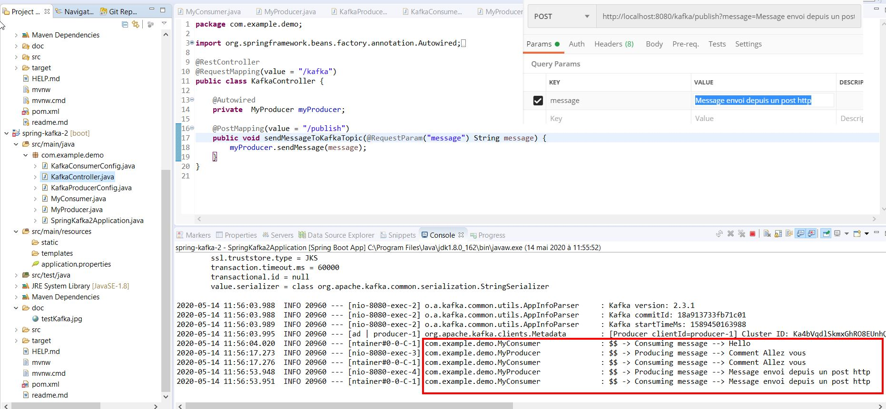

# spring kafka


## Classes de configuration

ici nous creer deux classes de configuration pour le **consumer** et le **producer**


**KafkaConsumerConfig**  

Configure les parametres du consumer en lieu et place du fichier application.properties puis renvoi un objet **ConcurrentKafkaListenerContainerFactory**.

```java

@Configuration
public class KafkaConsumerConfig {

	@Value("${kafka.bootstrap-servers}")
	private String bootstrapServers;

	@Bean
	public Map<String, Object> consumerConfigs() {

		Map<String, Object> configProps = new HashMap<String, Object>();
		// list of host:port pairs used for establishing the initial connections to the Kafka cluster
		configProps.put(ConsumerConfig.BOOTSTRAP_SERVERS_CONFIG, bootstrapServers);
		configProps.put(ConsumerConfig.KEY_DESERIALIZER_CLASS_CONFIG, StringDeserializer.class);
		configProps.put(ConsumerConfig.VALUE_DESERIALIZER_CLASS_CONFIG, StringDeserializer.class);
		// allows a pool of processes to divide the work of consuming and processing  records
		configProps.put(ConsumerConfig.GROUP_ID_CONFIG, "group-id");

		return configProps;
	}

	@Bean
	public ConsumerFactory<String, String> consumerFactory() {
		return new DefaultKafkaConsumerFactory<String, String>(consumerConfigs());
	}

	@Bean
	public ConcurrentKafkaListenerContainerFactory<String, String> concurrentKafkaListenerContainerFactory() {
		ConcurrentKafkaListenerContainerFactory<String, String> factory = new ConcurrentKafkaListenerContainerFactory<String, String>();
		factory.setConsumerFactory(consumerFactory());
		return factory;
	}
}

```


**KafkaProducerConfig**  

Configure les parametres du producer en lieu et place du fichier application.properties puis renvoi un objet **KafkaTemplate**.

```java

	  @Value("${kafka.bootstrap-servers}")
	  private String bootstrapServers;
	  
	  @Bean
	  public Map<String, Object> producerConfigs() {

			Map<String, Object> configProps = new HashMap<String, Object>();
			configProps.put(ProducerConfig.BOOTSTRAP_SERVERS_CONFIG , bootstrapServers );
			configProps.put(ProducerConfig.KEY_SERIALIZER_CLASS_CONFIG , StringSerializer.class);
			configProps.put(ProducerConfig.VALUE_SERIALIZER_CLASS_CONFIG , StringSerializer.class);

	    return configProps;
	  }
	  
	  
	@Bean
	public ProducerFactory<String, String> producerFactory(){
		return new DefaultKafkaProducerFactory<String, String>(producerConfigs());
	}
	
	@Bean
	public KafkaTemplate<String, String> kafkaTemplate(){
		return new KafkaTemplate<String, String>(producerFactory());
	}
	
```


## Creation d'un restcontroller, consumer et un producer


**restcontroller**  

```java
@RestController
@RequestMapping(value = "/kafka")
public class KafkaController {

	@Autowired
	private  MyProducer myProducer;

	@PostMapping(value = "/publish")
	public void sendMessageToKafkaTopic(@RequestParam("message") String message) {
		myProducer.sendMessage(message);
	}
}
```

**consumer**

```java
@Service
public class MyConsumer {

	private static final Logger logger = LoggerFactory.getLogger(MyConsumer.class);
	private static final String TOPIC = "users";

	@KafkaListener(topics = TOPIC , groupId = "group_id" )
	public void consumer(String message) {
		logger.info(String.format("$$ -> Producing message --> %s", message));

	}
}
```

**producer**

```java
@Service
public class MyProducer {

	private static final Logger logger = LoggerFactory.getLogger(MyProducer.class);
	private static final String TOPIC = "users";
	
	@Autowired
	private KafkaTemplate<String, String> kafkaTemplate;
	
	public void sendMessage(String message) {
		logger.info(String.format("$$ -> Producing message --> %s", message));
		kafkaTemplate.send(TOPIC,message);
	}		
}
```


## Démarrage de zookepeer
```shell
λ .\bin\windows\zookeeper-server-start.bat  .\config\zookeeper.properties
```

## Démarrage de server kafka

```shell
λ .\bin\windows\kafka-server-start.bat .\config\server.properties
```

## test

**postman**  


 
**curl command line**
 
```shell
λ curl -d "message=Bonjour tout le monde" -H "Content-Type: application/x-www-form-urlencoded" -X POST http://localhost:8080/kafka/publish
```


